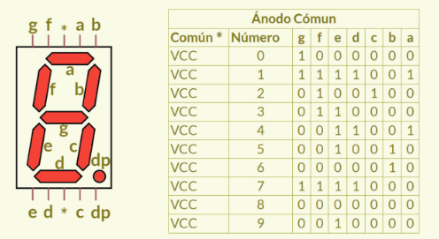
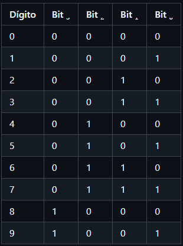
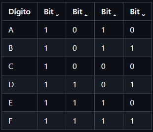
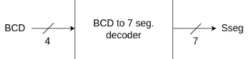

# Lab02 - Decodificador BCD a 7 segmentos y algoritmo Double Dabble

# Integrantes

* [Daniel Penagos Castro](...)
* [Danilo Forero Rodriguez](...)
* [Brayan Extidt Torres Gaona](...)

# Informe

Indice:

1. [Documentación del diseño implementado](#documentación-del-diseño-implementado)
2. [Simulaciones](#simulaciones)
3. [Evidencias de implementación](#evidencias-de-implementación)
4. [Preguntas](#preguntas)
5. [Conclusiones](#conclusiones)
6. [Referencias](#referencias)

---

## Documentación del diseño implementado

### 1. Decodificador BCD a 7 segmentos
El BCD es un esquema de representacion numerica para que cada digito decimal se pueda codificar utilizando cuatro digitos binarios.Se utiliza en sistemas digitales donde se requieren operaciones aritmeticas decimales.

#### 1.1 Descripción
Diseñar un cotrolador para display 7 segmentos segun el tipo de display con su respectiva tabla de verdad  para una representacion hezadecimal en la cuales se debera convertir numeros binarios de 2 digitos BCD(unidades y decenas) y 1 bit de signo (0=positivo, 1= negativo) para asi visualizar el resultado del sumador restador de 4 bits en los display 7 segmentosque viene incluido en la FPGA
 
*Figura 1: Arquitectura del Display 7 Segmentos*
#### 1.2 Tabla de verdad
En BCD es un sistema de numeracion en el cual odemos representar cada numero decimal utilizando 4 bits de numeros binarios pero como solo hay 10 digitos en el sistema decimal para representarlos podemos hacer la combinacion de 4 bits binarios es decir:

 
*Figura 2: Tabla de verdad de las combinaciones del decodificador BCD hasta 10.*

Para representar de forma binaria los numeros decimales del 10 al 15 pero con su respectiva representacion en el sistema hezadecima es de la siguiente forma:
 
*Figura 3: Tabla de verdad de las combinaciones del decodificador BCD de 10 hasta 15.*

#### 1.3 Diseño en Verilog

...

#### 1.4 Diagramas
Bloque funcional del diseño

 
*Figura 4: Bloque del BCD*

Es el diseño y sintentizacion e implementacion del display 7 segmentos para que permita visualizar los numeros en representacion hexadecimal en uno de los displays.

### 2. Conversión de binario a BCD mediante Double Dabble
Es un algoritmo Double Dabble o Shift-and-add-3, Es un metodo matematico y logico utilizandola electronica digital para convertir numeros binarios puros a la notacion BCD(Decimal Codificados en Binario)
#### 2.1 Descripción
Su funcionamiento consta de transformar una serie de numeros binarios en grupos independientes de 4 bits para que cada grupo pueda representar directamente un digito decimal del 0 al 9.
¿Por que se necesita?RTA: Las computadoras o circuitos procesan los datos de forma binaria natural ya que es mas eficiente sin embargo los humanos leemos en base 10(decimal) para mostrar un numero binario grande en patalla ya sea 7 segmentos o LCD no podemos conectar el binario directo, Necescitamos aislar las unidades, las decenas y las centenas.

#### 2.2 Funcionamiento del algoritmo
El proceso se basa en un registro que se divide en las colubnas BCD necesarias(Centenas, Decenas, Unidades) a la izquierda, El numero binario original a la derecha sae siguen dos reglas basicas en un ciclo repetitivo en cada bit que tenga el numero a convertir entonces: para evaluar el Dabble se mira cada columna BCD de 4 bits de manera independiente si el valor de alguna columna es igual o mayor a 5, se le suma 3. si es menor a 5 no hace nada. para desplazar (double) se desplazan todos los bits un espacio hacia la izquierda. Esto equivale a multiplicar el valor por 2 en cada paso.

#### 2.3 Ejemplo de conversión
El número tiene 4 bits, por lo que se necesitan 4 iteraciones.
El registro BCD tiene 2 grupos: [Decenas | Unidades]

Para entender el funcionamiento del algoritmo **Double Dabble** limitado a dos dígitos decimales, convertiremos el número binario de 7 bits `1010110` (que equivale al **86** en decimal) a formato **BCD**.

 Configuración Inicial:
* **Número Binario:** `1010110` (7 bits = realizaremos exactamente 7 desplazamientos).
* **Columnas BCD necesarias:** Decenas (4 bits) y Unidades (4 bits).

### Tabla de Estados del Algoritmo:

| Paso / Operación | Decenas (BCD) | Unidades (BCD) | Binario Inicial |
| :--- | :---: | :---: | :---: |
| **0. Estado Inicial** | `0000` | `0000` | `1010110` |
| 1. Desplazamiento 1 | `0000` | `0001` | `010110_` |
| 2. Desplazamiento 2 | `0000` | `0010` | `10110__` |
| 3. Desplazamiento 3 | `0000` | `0101` | `0110___` |
| *Evaluar:* Unidades es 5 (≥ 5) → **Sumar 3** | `0000` | **`1000`** | `0110___` |
| 4. Desplazamiento 4 | `0001` | `0000` | `110____` |
| 5. Desplazamiento 5 | `0010` | `0001` | `10_____` |
| 6. Desplazamiento 6 | `0100` | `0011` | `0______` |
| 7. Desplazamiento 7 (Final) | **`1000`** | **`0110`** | `_______` |

Resultado Final:
Al completarse los 7 desplazamientos, leemos directamente los bloques BCD resultantes:
* **Decenas:** `1000` = **8**
* **Unidades:** `0110` = **6**

El resultado en BCD es `1000 0110`, lo cual representa correctamente al número **86** en decimal.

#### 2.4 Implementación en Verilog

...

### 3. Integración del sistema

#### 3.1 Descripción

...

#### 3.2 Funcionamiento

...

#### 3.3 Diagrama general

...

---

## Simulaciones

### 1. Simulación del decodificador BCD a 7 segmentos

#### 1.1 Descripción

...

#### 1.2 Diagrama

...

### 2. Simulación del algoritmo Double Dabble

...

### 3. Simulación del sistema completo

...

---

## Evidencias de implementación

* **Asignación de pines en la FPGA:**
  * ...
  * ...
  * ...

* **Funcionamiento en la tarjeta:**

...

---

## Preguntas

**1. ¿Qué es BCD y por qué se utiliza en este diseño?**

...

**2. ¿Cuál es la diferencia entre un display de ánodo común y uno de cátodo común?**

...

**3. ¿Por qué es necesario utilizar Double Dabble?**

...

**4. ¿Por qué el algoritmo suma 3 cuando un nibble es mayor o igual a 5?**

...

**5. ¿Qué ventaja tiene realizar esta conversión mediante hardware?**

...

---

## Conclusiones

* ...
* ...
* ...

---

## Referencias

* Harris, D. M., & Harris, S. L. ...
* Brown, S., & Vranesic, Z. ...
* Guía de laboratorio Lab02 ...