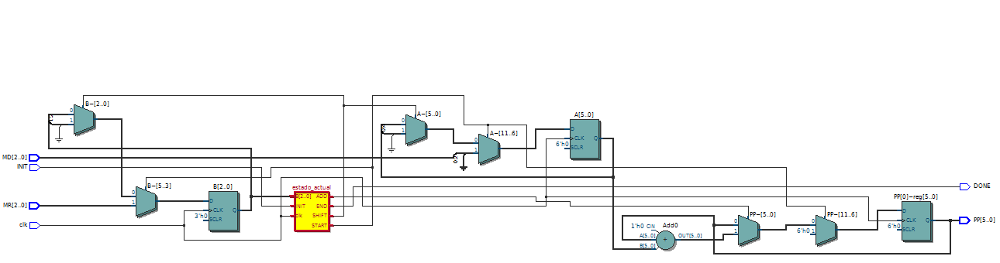
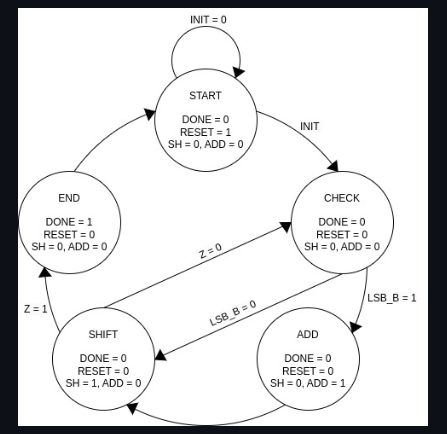
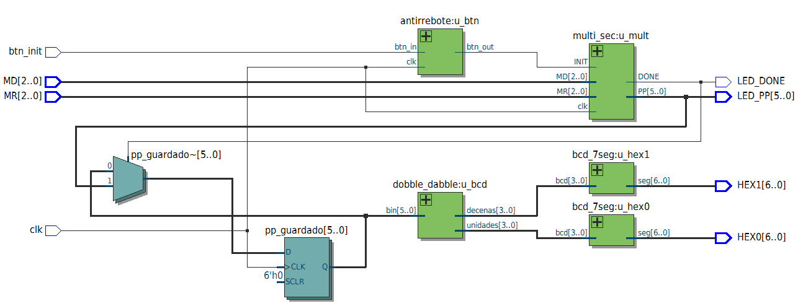
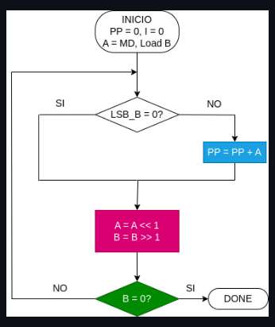
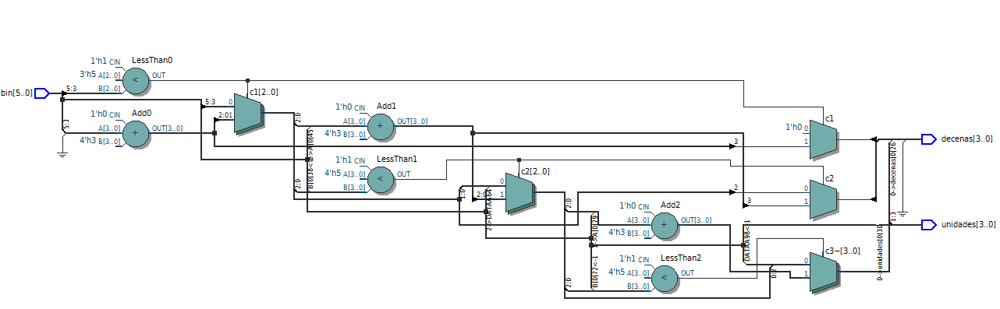

# Lab03 - Multiplicador de 3 bits usando Máquina de Estados

# Integrantes
* [Daniel Penagos Castro](https://github.com/Daniel-Penagos)
* [Danilo Forero Rodriguez](https://github.com/jouseddanilo)
* [Brayan Extidt Torres Gaona](https://github.com/BrayanExtidt)

# Informe

Indice:

1. [Teoria Fundamental](#teoria-fundamental)
2. [Simulaciones](#simulaciones)
3. [Evidencias de implementación](#evidencias-de-implementación)
4. [Preguntas](#preguntas)
5. [Conclusiones](#conclusiones)
6. [Referencias](#referencias)

---

## Teoria Fundamental

### 1. Multiplicación Secuencial mediante ASM
La multiplicación secuencial es una técnica de diseño de hardware en la cual, en lugar de calcular el producto completo en un solo ciclo mediante un circuito combinacional de gran tamaño y consumo de área, la operación se divide paso a paso en múltiples ciclos de reloj. Este método reutiliza un sumador binario pequeño y un registro de desplazamiento, procesando los operandos bit a bit a lo largo del tiempo.

#### 1.1 Descripción y Bloque Funcional
El diseño del multiplicador secuencial de 3 bits se compone de dos bloques principales que trabajan en conjunto bajo una arquitectura de procesador específico: la **Ruta de Datos (Datapath)** y la **Unidad de Control (FSM/ASM)**.

El módulo recibe un multiplicando (**MD**) de 3 bits y un multiplicador (**MR**) de 3 bits. Al iniciar el proceso mediante la señal de control `INIT`, el sistema calcula iterativamente el producto parcial y entrega como resultado final un valor de 6 bits (`PP`) acompañado de una señal indicadora de finalización (`DONE`).

 
*Figura 1: Bloque funcional general del Multiplicador Secuencial.*

#### 1.2 Ruta de Datos (Datapath)
Es el bloque encargado de almacenar, desplazar y operar los datos numéricos. Sus componentes principales son:
* **Registro MD:** Almacena el multiplicando de 3 bits ($m$ bits).
* **Registro MR:** Almacena el multiplicador de 3 bits ($m$ bits) y realiza desplazamientos a la derecha bit por bit en cada ciclo.
* **Acumulador / Registro de Productos Parciales (`PP`):** Registro de 6 bits ($2m$ bits) que almacena la suma acumulada del producto final.
* **Sumador Binario:** Circuito aritmético que adiciona el multiplicando (`MD`) al acumulador únicamente cuando el bit menos significativo (`LSB`) del registro `MR` es igual a `1`.

 
*Figura 2: Esquemático RTL de la estructura de la Ruta de Datos (Datapath).*

#### 1.3 Bloque de Control (Máquina de Estados Finita - FSM)
La Unidad de Control es una Máquina de Estados Algorítmica encargada de coordinar las operaciones del Datapath en cada ciclo de reloj. No realiza cálculos aritméticos directos, sino que genera las señales de habilitación (`SH`, `ADD`, `RESET`, `DONE`) necesarias:

 
*Figura 3: Diagrama de la Máquina de Estados Finita (FSM) de control.*

* **START:** Espera la activación de la señal `INIT`. Mantiene `DONE = 0`, `RESET = 1`, `SH = 0` y `ADD = 0` para inicializar los registros.
* **CHECK:** Verifica el bit menos significativo del multiplicador (`LSB_B`).
  * Si `LSB_B = 1`, conmuta al estado **ADD**.
  * Si `LSB_B = 0`, conmuta directamente al estado **SHIFT**.
* **ADD:** Activa la señal `ADD = 1` para que el acumulador sume el valor del multiplicando `MD`.
* **SHIFT:** Activa la señal `SH = 1` para desplazar los registros y verifica la bandera de finalización `Z`.
  * Si `Z = 0` (aún quedan bits por procesar), regresa al estado **CHECK**.
  * Si `Z = 1` (se procesaron todos los bits), avanza al estado **END**.
* **END:** Activa la señal `DONE = 1`, indicando que la multiplicación ha finalizado y el resultado final está disponible en `PP`.

 
*Figura 4: Vista RTL de la integración de la Unidad de Control.*

#### 1.4 Diagrama de Flujo del Algoritmo
El flujo algorítmico que ejecuta el sistema durante el proceso de multiplicación secuencial sigue la siguiente lógica de decisión y flujo de estados:

 
*Figura 5: Diagrama de flujo de estados de la ASM.*

 
*Figura 6: Diagrama de flujo algorítmico detallado del proceso de multiplicación.*

---

### 2. Conversión de Binario a BCD mediante Double Dabble
El algoritmo **Double Dabble** (o *Shift-and-Add-3*) es un procedimiento algorítmico implementado en hardware para convertir números binarios puros a la notación BCD (Decimal Codificado en Binario).

#### 2.1 Descripción
Dado que el multiplicador secuencial de 3 bits genera un resultado binario de 6 bits (con un rango de `000000` = `0` a `111101` = `49`), no es posible conectar este bus directamente a los displays de 7 segmentos de la FPGA. Se requiere aislar los dígitos decimales de **Decenas** y **Unidades** en bloques BCD independientes de 4 bits cada uno.

#### 2.2 Funcionamiento del Algoritmo
El algoritmo procesa el número binario bit a bit desplazándolo hacia la izquierda dentro de un registro que contiene los bloques BCD de salida. Sigue dos reglas iterativas:
1. **Evaluación de Nibbles:** Se examina cada bloque BCD de 4 bits. Si el valor es mayor o igual a 5 (`>= 5`), se le suman 3 (`+ 3`). Si es menor a 5, no se modifica.
2. **Desplazamiento (Shift):** Se desplaza todo el registro un bit hacia la izquierda, ingresando el siguiente bit del número binario por la derecha.

#### 2.3 Ejemplo de Conversión
Para convertir el valor máximo posible del multiplicador, $7 \times 7 = 49$ (`110001` en binario de 6 bits):

* **Entrada Binaria:** `110001` (6 bits = 6 desplazamientos).
* **Bloques BCD:** Decenas (4 bits) | Unidades (4 bits).

| Iteración | Operación | Decenas | Unidades | Binario |
| :---: | :--- | :---: | :---: | :---: |
| 0 | Inicio | `0000` | `0000` | `110001` |
| 1 | Shift 1 | `0000` | `0000` | `10001_` |
| 2 | Shift 2 | `0000` | `0001` | `0001__` |
| 3 | Shift 3 | `0000` | `0011` | `001___` |
| 4 | Shift 4 | `0000` | `0011` | `01____` |
| 5 | Shift 5 | `0000` | `0110` | `1_____` |
| 5.1 | Unidades >= 5 ($6 \ge 5$) $\rightarrow$ Suma 3 | `0000` | **`1001`** | `1_____` |
| 6 | Shift 6 | `0000` | `0010` | `______` |
| **Final** | **Resultado:** BCD Decenas = 4 (`0100`), Unidades = 9 (`1001`) | **`0100`** | **`1001`** | `______` |

#### 2.4 Implementación en Verilog

 
*Figura 7: Esquemático RTL del módulo conversor Double Dabble.*

---

### 3. Integración del Sistema

#### 3.1 Descripción
El sistema completo (módulo Top) integra el multiplicador secuencial de 3 bits, el conversor Double Dabble y dos decodificadores BCD a 7 segmentos. Esta arquitectura permite ingresar dos operandos mediante interruptores de la tarjeta FPGA y desplegar el resultado en formato decimal sobre los displays de 7 segmentos.

#### 3.2 Funcionamiento del Top Module
1. **Entrada de datos:** Los operandos `MD` (3 bits) y `MR` (3 bits) se ingresan mediante switches, y la señal `INIT` mediante un pulsador.
2. **Procesamiento Aritmético:** El bloque `mult` ejecuta la multiplicación secuencial coordinada por la FSM, generando el resultado de 6 bits (`PP`) y activando `DONE`.
3. **Conversión de Formato:** El bus de 6 bits `PP` es tomado por el módulo `double_dabble`, separando el valor en nibbles de 4 bits para Decenas y Unidades.
4. **Visualización:** Cada nibble BCD entra a un módulo decodificador que controla las salidas de los displays de 7 segmentos.

---

## Simulacion

### 1. Simulación del Sistema Completo (Testbench)

#### 1.1 Descripción
Se diseñó un testbench en Verilog para validar el comportamiento temporal del multiplicador y los módulos de conversión. Se evaluaron casos de prueba límite, tales como:
* $0 \times 0 = 0$
* $7 \times 1 = 7$
* $7 \times 7 = 49$

En la simulación se verifica que la señal `DONE` se active exactamente al finalizar el conteo de ciclos de la máquina de estados y que la salida del Double Dabble mantenga el valor correcto una vez terminada la operación.

---

## Evidencias de implementación

* **Asignación de Pines en la FPGA:**

 
*Figura 8: Asignación de pines en la FPGA mediante Pin Planner.*

* **Funcionamiento en la Tarjeta:**

En el siguiente enlace se puede observar el funcionamiento físico e implementación del sistema completo:

[**Ver video de la simulación y prueba en hardware**](Video/Videofun.mp4)

*\*Figura 9: Demostración en video de la multiplicación secuencial y visualización en displays.\**

---

## Preguntas

**1. ¿Qué ventajas tiene un multiplicador secuencial frente a uno combinacional?**
Un multiplicador secuencial reduce drásticamente el área ocupada en la FPGA y el consumo de recursos de hardware (LUTs y compuertas lógicas), ya que reutiliza un único sumador binario pequeño para todos los ciclos de la operación. En contraste, un multiplicador combinacional requiere una red extensa de sumadores en paralelo que crece exponencialmente con el número de bits.

**2. ¿Por qué es necesario utilizar una Máquina de Estados (FSM) en este diseño?**
La Máquina de Estados es indispensable para sincronizar la secuencia de pasos temporales (carga de datos en `START`, verificación del LSB en `CHECK`, suma acumulada en `ADD`, desplazamiento en `SHIFT` y generación del pulso final en `END`). Garantiza que cada operación ocurra en el ciclo de reloj correcto y permite coordinar de forma ordenada el Datapath.

**3. ¿Cómo influye el tamaño de los operandos en el número de ciclos de reloj requeridos?**
En este multiplicador de 3 bits, el algoritmo requiere iteraciones equivalentes al número de bits $m$. Si los operandos fueran de $N$ bits, el multiplicador requeriría $N$ ciclos de procesamiento principal. El tiempo de cálculo escala linealmente $\mathcal{O}(N)$ con el número de bits del multiplicador.

**4. ¿Por qué el algoritmo Double Dabble suma 3 cuando un nibble es mayor o igual a 5?**
Se suma 3 porque en la codificación BCD los valores válidos por cada dígito abarcan únicamente del 0 al 9 (base 10), mientras que un nibble binario puede representar del 0 al 15 (base 16). La diferencia entre ambas bases al realizar un desplazamiento a la izquierda (multiplicación por 2) es de 6 unidades ($16 - 10 = 6$). Al sumar 3 antes del desplazamiento, el efecto duplicador posterior equivale a haber sumado 6 ($3 \times 2 = 6$), ajustando automáticamente el acarreo hacia el siguiente grupo BCD de decenas o centenas.

**5. ¿Qué función cumple la señal `DONE` en el diseño del multiplicador?**
La señal `DONE` actúa como una bandera de sincronismo (handshake). Indica a los módulos externos o displays que el proceso iterativo de la máquina de estados ha concluido en el estado `END` y que el dato presente en el bus de salida `PP` de 6 bits es estable y válido para ser registrado o visualizado.

---

## Conclusiones

* Se diseñó e implementó exitosamente un multiplicador secuencial de 3 bits controlado por una Máquina de Estados Finita (FSM) en Verilog HDL.
* Se integraron de forma completa todas las evidencias gráficas del diseño: diagrama funcional (`Bloque de Multiplicador.png`), RTLs del sistema (`RTL-Multisec.png`, `RTL-MULTIC.png`, `RTL-Dobble.png`), diagramas de flujo y FSM (`Estados-de-Control.png`, `Flujo de estados.png`, `Logica-de-Estados.png`), y asignación de pines (`Pinplaner.png`).
* Se comprobó experimentalmente la eficiencia del enfoque secuencial, optimizando el uso de recursos lógicos en la tarjeta de desarrollo respecto a soluciones puramente combinacionales.
* Se integró el algoritmo Double Dabble con decodificadores de 7 segmentos para realizar la conversión directa de binario a BCD en hardware, permitiendo la lectura decimal del resultado final.

---

## Referencias

* Harris, D., & Harris, S. (2012). *Digital Design and Computer Architecture*. Morgan Kaufmann.
* Guía de laboratorio Lab03 - Multiplicador de 3 bits usando Máquina de Estados, Arquitectura de Procesadores ECCI.
* Wakerly, J. F. (2001). *Diseño digital: Principios y prácticas*. Pearson Educación.